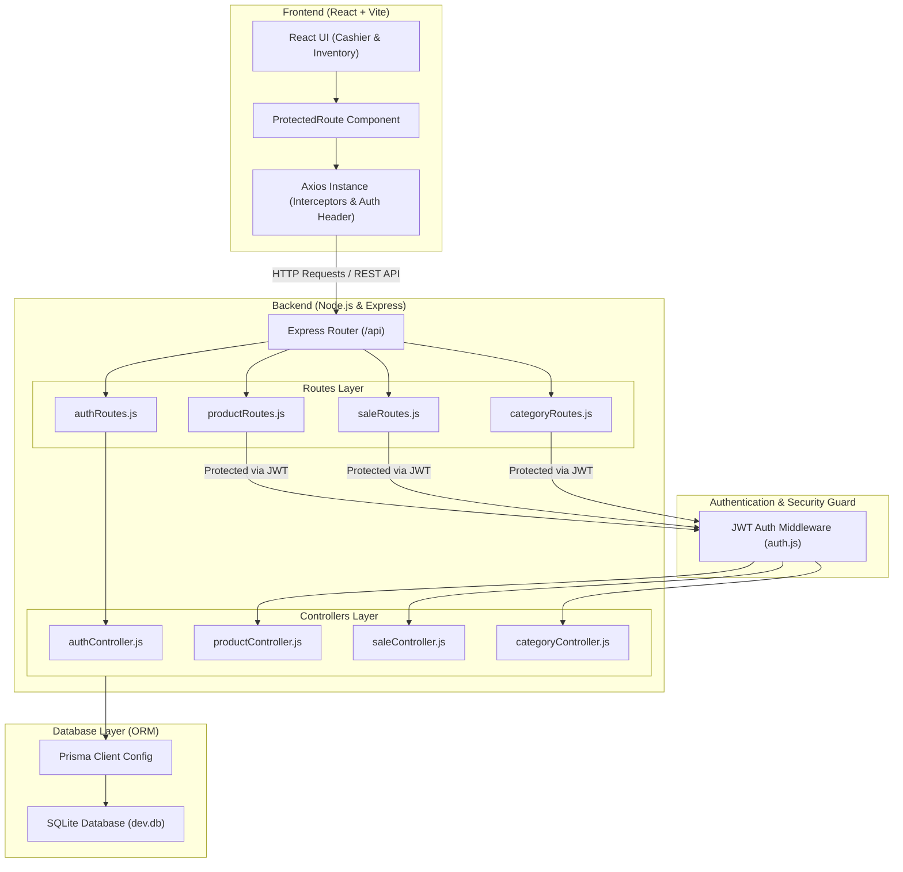

# 🛒 React POS System (Point of Sale)

## 📌 Product Requirement Document (PRD)

### 🎯 Project Overview
A fast, modular Point of Sale (POS) web application designed for cashier speed and efficient inventory tracking. Built to handle real-time shopping cart calculations, scanner input, and inventory alerts without page reloads.

---

### 🚀 Key Features
* **Cashier Interface:**
  * Barcode scanner support (auto-submits on Enter key).
  * Real-time item additions, quantity updates, and deletions.
  * Instant subtotal, discount, final amount, and change due calculations.
  * Direct invoice submission to the backend database.
* **Inventory Management:**
  * Dedicated route for stock control and product entry.
  * Real-time inventory table with status indicators.
  * Automated visual alert (highlighting) for out-of-stock items ($0$).
* **Architecture & Navigation:**
  * Seamless client-side routing via `react-router-dom`.
  * Clean component separation between Checkout (`Cashier.jsx`) and Stock (`Inventory.jsx`).

---

### 🛠️ Tech Stack
* **Frontend:** React.js, React Router DOM, Vite, CSS3.
* **Backend:** Node.js, Express.js.
* **Database:** SQLite (`store.db`).

---

## 💻 Getting Started

### 1. Clone the Repository
git clone [https://github.com/abdullahalhwaidi/pos-system.git](https://github.com/abdullahalhwaidi/pos-system.git)
cd pos-system

## 🔄 مخطط تدفق العمليات (Process Flow)

